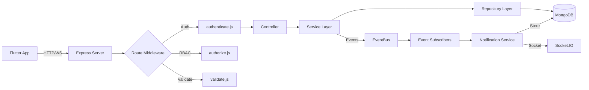
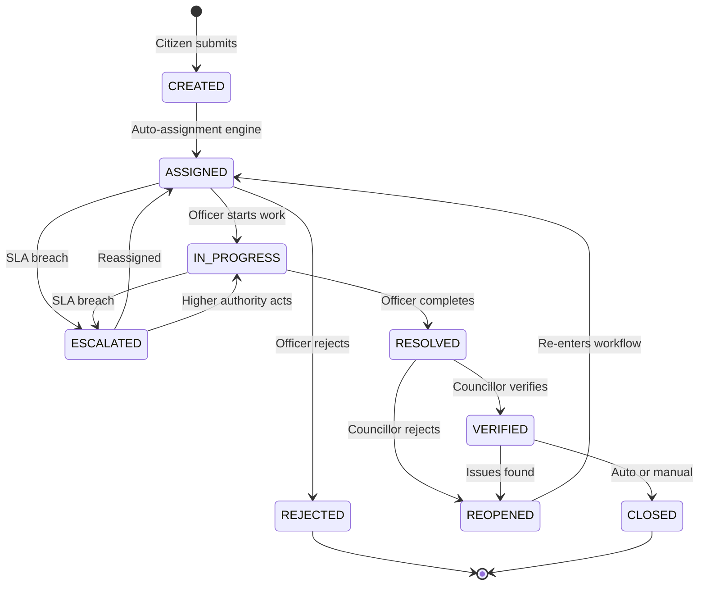
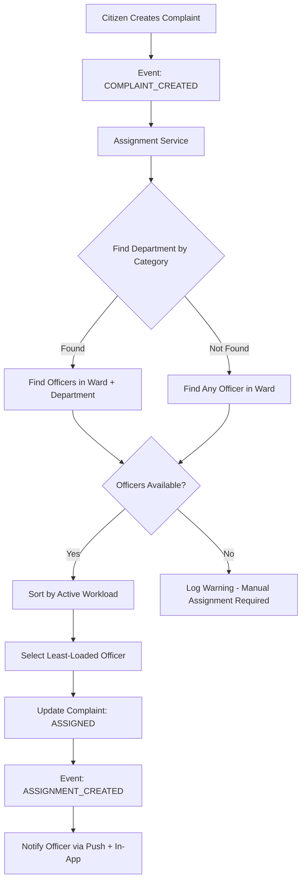
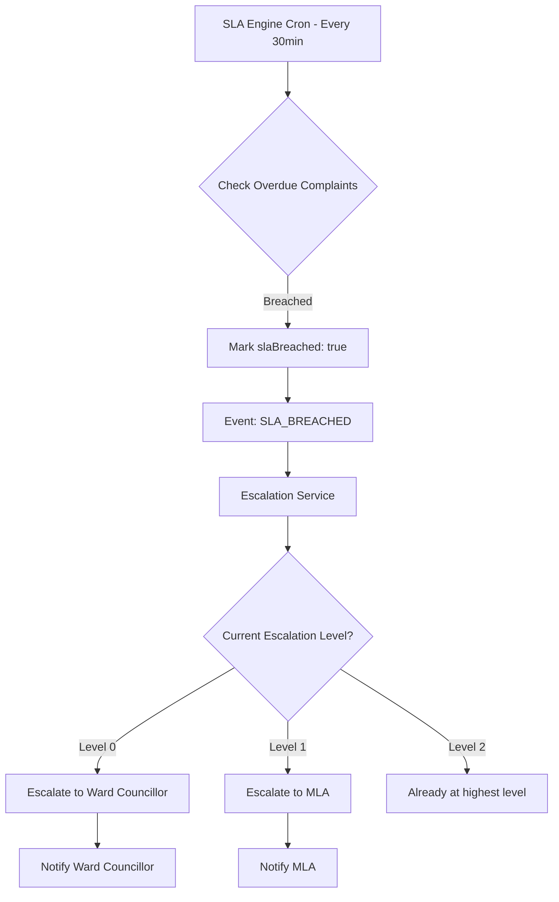

# 🏛️ MLA-Backend — Architecture Walkthrough

## Complete Backend Delivery Summary

This document walks through every component of the **Enterprise Smart Grievance Management & Public Service Monitoring System** backend.

---

## 📁 Files Generated (75 files total)

### Foundation (7 files)
| File | Purpose |
|------|---------|
| [package.json](file:///d:/Projects/MLA-Backend/package.json) | Dependencies & scripts |
| [.env.example](file:///d:/Projects/MLA-Backend/.env.example) | Environment template |
| [.gitignore](file:///d:/Projects/MLA-Backend/.gitignore) | Git exclusions |
| [Dockerfile](file:///d:/Projects/MLA-Backend/Dockerfile) | Docker build |
| [docker-compose.yml](file:///d:/Projects/MLA-Backend/docker-compose.yml) | Container orchestration |
| [.dockerignore](file:///d:/Projects/MLA-Backend/.dockerignore) | Docker build exclusions |
| [README.md](file:///d:/Projects/MLA-Backend/README.md) | Full documentation |

### Config & Database (4 files)
| File | Purpose |
|------|---------|
| [config/index.js](file:///d:/Projects/MLA-Backend/src/config/index.js) | Centralized env config |
| [config/swagger.js](file:///d:/Projects/MLA-Backend/src/config/swagger.js) | Swagger/OpenAPI setup |
| [database/connection.js](file:///d:/Projects/MLA-Backend/src/database/connection.js) | MongoDB connection |
| [database/seed.js](file:///d:/Projects/MLA-Backend/src/database/seed.js) | Development seed data |

### Shared Infrastructure (11 files)
| File | Purpose |
|------|---------|
| [shared/logger/index.js](file:///d:/Projects/MLA-Backend/src/shared/logger/index.js) | Winston structured logging |
| [shared/events/eventBus.js](file:///d:/Projects/MLA-Backend/src/shared/events/eventBus.js) | In-process event bus |
| [shared/events/eventNames.js](file:///d:/Projects/MLA-Backend/src/shared/events/eventNames.js) | Event name registry |
| [shared/constants/index.js](file:///d:/Projects/MLA-Backend/src/shared/constants/index.js) | Domain constants & enums |
| [shared/middlewares/authenticate.js](file:///d:/Projects/MLA-Backend/src/shared/middlewares/authenticate.js) | JWT authentication |
| [shared/middlewares/authorize.js](file:///d:/Projects/MLA-Backend/src/shared/middlewares/authorize.js) | RBAC middleware |
| [shared/middlewares/errorHandler.js](file:///d:/Projects/MLA-Backend/src/shared/middlewares/errorHandler.js) | Global error handler |
| [shared/middlewares/validate.js](file:///d:/Projects/MLA-Backend/src/shared/middlewares/validate.js) | Request validation |
| [shared/security/index.js](file:///d:/Projects/MLA-Backend/src/shared/security/index.js) | Security middleware suite |
| [shared/utils/errors.js](file:///d:/Projects/MLA-Backend/src/shared/utils/errors.js) | Custom error classes |
| [shared/utils/ApiResponse.js](file:///d:/Projects/MLA-Backend/src/shared/utils/ApiResponse.js) | Response standardization |
| [shared/utils/asyncHandler.js](file:///d:/Projects/MLA-Backend/src/shared/utils/asyncHandler.js) | Async error catching |
| [shared/utils/helpers.js](file:///d:/Projects/MLA-Backend/src/shared/utils/helpers.js) | OTP, geo, pagination utils |
| [shared/validators/index.js](file:///d:/Projects/MLA-Backend/src/shared/validators/index.js) | Reusable validation chains |

### Domain Modules (48 files across 12 modules)

Each module follows the pattern: **Model → Repository → Service → Controller → Validators → Routes**

---

## 🏛️ Architecture Decisions

### 1. Why Modular Monolith (not Microservices)?
- **Free-tier friendly**: Single process, single deployment
- **Low complexity**: No service mesh, no API gateway needed
- **Fast development**: Shared code, no network overhead
- **Easy debugging**: Single log stream, single stack trace
- **Upgrade path**: Module boundaries make future extraction trivial

### 2. Why In-Process EventBus (not Redis/RabbitMQ)?
- **Zero infrastructure cost**: Uses Node.js built-in EventEmitter
- **Same interface**: When ready for Redis Pub/Sub, just swap the EventBus implementation
- **Sufficient for single-server**: All modules run in the same process anyway

### 3. Why node-cron (not BullMQ)?
- **No Redis dependency**: Runs entirely in-process
- **Sufficient for SLA monitoring**: 30-minute check interval is fine
- **Easy upgrade**: BullMQ has similar job scheduling API

---

## 🔄 Request Flow

## 📊 Complaint Lifecycle Flow

## 🔐 Auto-Assignment Engine Flow

## 📈 SLA & Escalation Flow

---

## 🗃️ Database Collections & Indexes

| Collection | Key Indexes | Purpose |
|-----------|------------|---------|
| **users** | `phone` (unique), `role+ward`, `role+department` | All user types |
| **otps** | `phone`, `expiresAt` (TTL) | Temporary OTPs with auto-delete |
| **complaints** | `trackingId` (unique), `status+ward+createdAt`, `assignedOfficer+status`, `citizen+createdAt`, `location` (2dsphere), `slaBreached+status` | Core grievances |
| **complaint_status_histories** | `complaint+createdAt` | Full audit trail |
| **upvotes** | `complaint+citizen` (unique compound) | One-per-citizen enforcement |
| **notifications** | `recipient+isRead+createdAt` | In-app notifications |
| **escalations** | `complaint+createdAt`, `toUser+isResolved` | Escalation tracking |
| **announcements** | `isActive+createdAt`, `targetWards+isActive` | Public announcements |
| **schemes** | `isActive+createdAt` | Government schemes |
| **departments** | `name` (unique), `code` (unique) | Category→department mapping |
| **analytics_logs** | `type+period+ward`, `type+period+officerId` | Precomputed analytics |

---

## 🎯 Key SLA Deadlines

| Priority | Resolution Deadline |
|----------|-------------------|
| 🔴 Critical | 4 Hours |
| 🟠 High | 24 Hours |
| 🟡 Medium | 3 Days |
| 🟢 Low | 7 Days |

---

## 🚀 Next Steps

1. **Copy `.env.example` to `.env`** and fill in your MongoDB Atlas URI
2. **Run `npm run seed`** to populate development data
3. **Run `npm run dev`** to start the development server
4. **Open `http://localhost:5000/api-docs`** for Swagger documentation
5. **Test auth flow**: Send OTP → Verify → Login with PIN
6. **Integrate with Flutter app** using the REST API + Socket.IO

> [!TIP]
> Default PIN for all seeded users is `123456`. MLA phone: `9000000001`. See seed.js for all test accounts.
